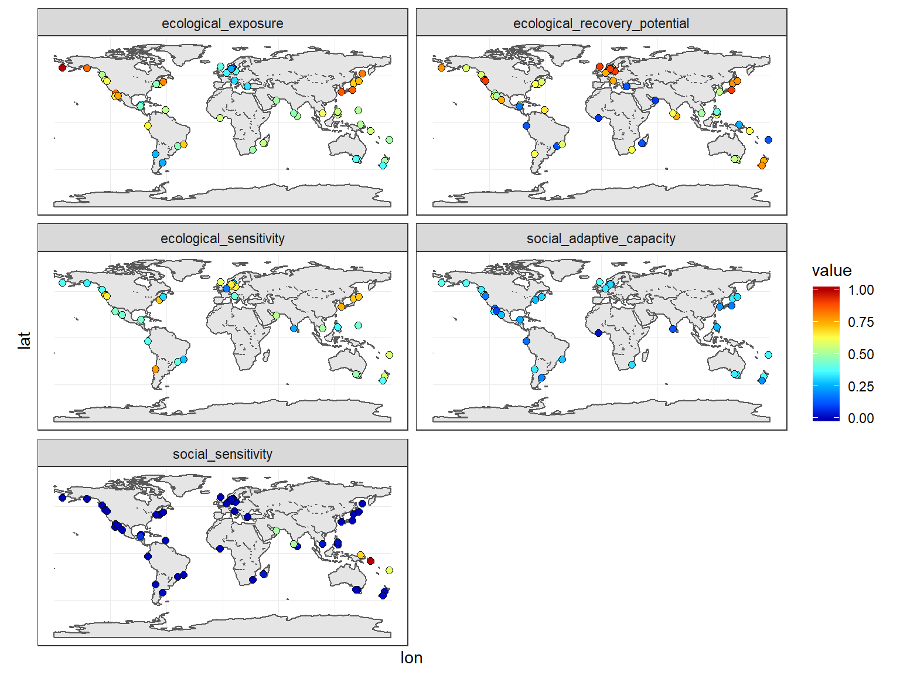
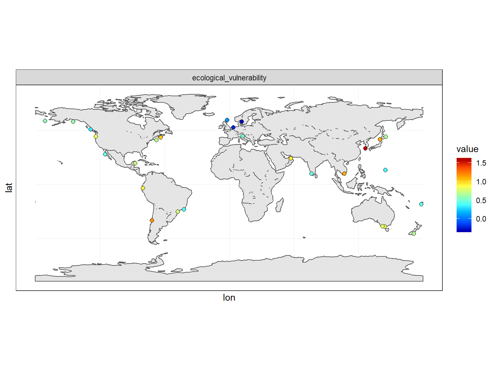
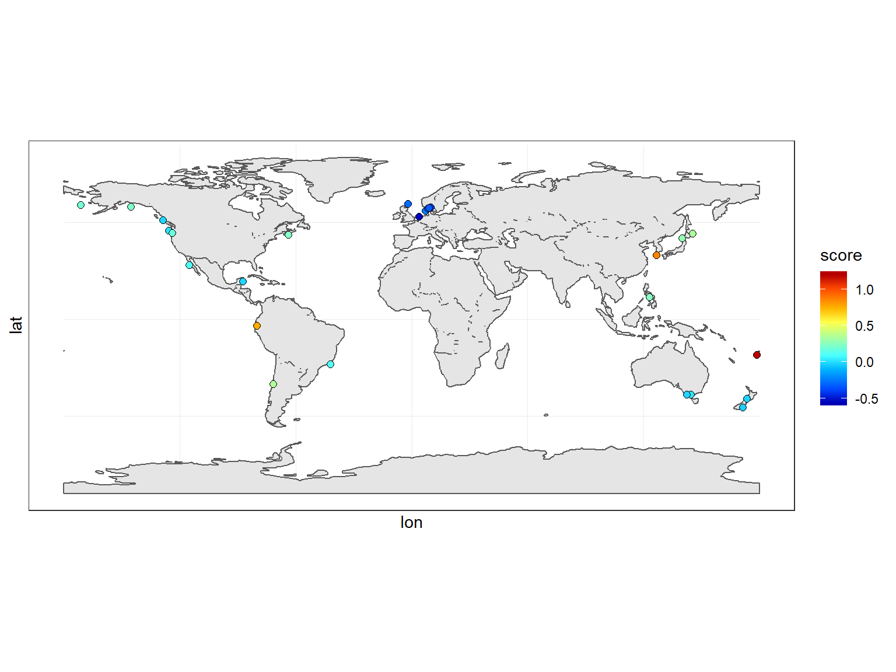
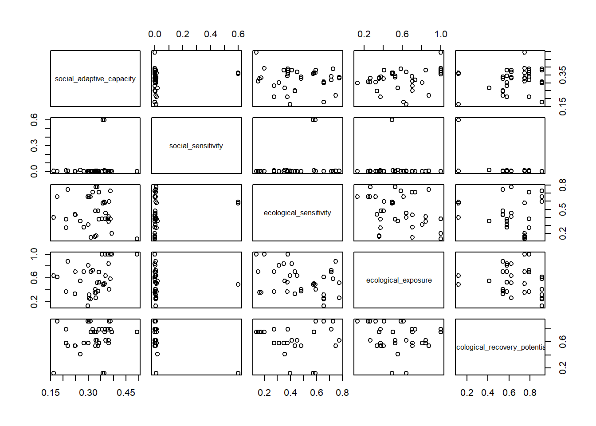
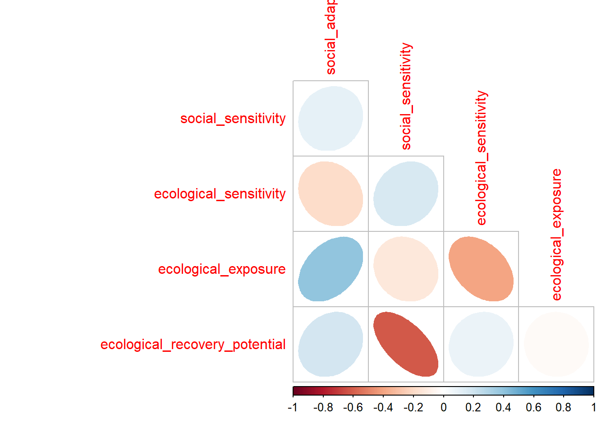
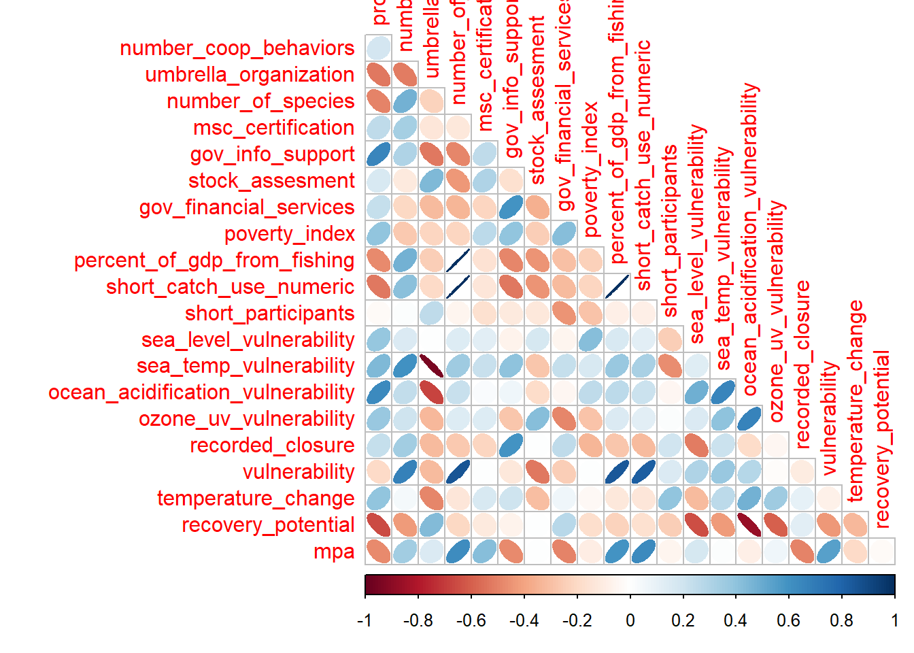
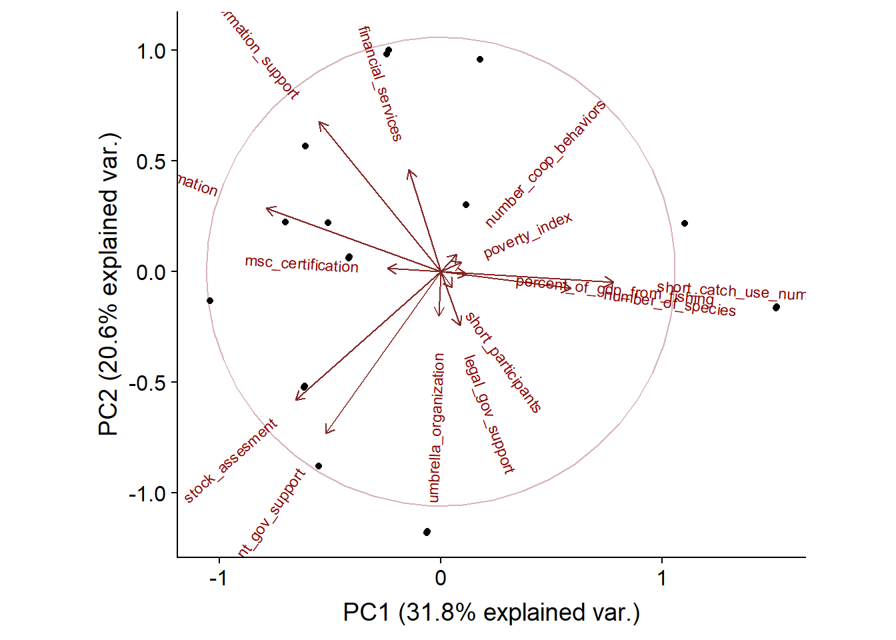

# Load packages


```r
suppressPackageStartupMessages({
  library(here)
  library(raster)
  library(tmap)
  library(sf)
  library(scales)
  library(cowplot)
  library(tidyverse)
})
```


# Read fish type data


```r
fish_type <- read.csv(here("raw_data", "fishtype.csv"),
                      stringsAsFactors = F,
                      strip.white = T)
```

## Read coordinate data


```r
coords <- read.csv(here("raw_data", "cooperative_coordinates.csv"),
                 stringsAsFactors = F,
                 strip.white = T) %>% 
  filter(!duplicated(.))
```

### Read species suceptibility (Jones & Cheung)


```r
jones_cheung <- read.csv(here("raw_data", "Jones_Cheung_SDATA.csv"))

jones_cheung_genus <- jones_cheung %>% 
  mutate(genus = stringr::str_extract(string = Complete_Name, pattern = "([^\\s]+)")) %>% 
  group_by(genus) %>% 
  summarize_if(is.numeric, mean) %>% 
  dplyr::select(genus, genusV = VulnerabilityIndex, genusR = RiskOfImpact)
```

### Read species scientific names and generate species suceptibility


```r
species_suceptibility <- read.csv(here("raw_data", "spp_sci_name.csv"))  %>% 
  mutate(genus = stringr::str_extract(string = Complete_Name, pattern = "([^\\s]+)")) %>% 
  left_join(jones_cheung) %>% 
  left_join(jones_cheung_genus) %>% 
  mutate(Vulnerability = ifelse(is.na(VulnerabilityIndex), genusV, VulnerabilityIndex)) %>% 
  dplyr::select(Original_Order, Vulnerability) %>% 
  janitor::clean_names()
```
 
## Extract temperatures


```r
proj2 <- "+proj=longlat +datum=WGS84 +ellps=WGS84 +towgs84=0,0,0"
data(World)
World <- as(World, "sf") %>% 
  sf::st_transform(proj2) %>% 
  mutate(N = 1) %>% 
  sf::st_union(by = N) %>% 
  sf::as_Spatial()
```


```r
# The script in scripts/change_in_temperature produces this RDS file. Run from command line for faster performance

r <- readRDS(file = here("data", "tsdiff.rds"))
```


```r
saltwater <- coords %>%
  left_join(fish_type, by = "fishery_id") %>% 
  filter(!fish_type %in% c("freshwater", "freshwater & diadromous")) %>%
  group_by(fishery_id) %>% 
  summarize(lon = mean(lon, na.rm = T), lat = mean(lat, na.rm = T)) %>% 
  rbind(data.frame(fishery_id = 0, lon = -31.427525, lat = -71.6063907)) %>% 
  filter(!is.na(lon))

xy <- data.frame(X = saltwater$lon, Y = saltwater$lat)
coordinates(xy) <- c("X", "Y")
proj4string(xy) <- proj2  ## for example
xy <- SpatialPointsDataFrame(xy, saltwater, proj4string = proj2)
```


```r
temps <- raster::extract(r, xy, buffer = 50000, fun = mean)
```


```r
coords <- cbind(xy, temps)
colnames(coords@data) <- c("fishery_id", "lon", "lat", "temperature_change")
coords <- coords@data
```

## Get all together


```r
coop <- read.csv(here("raw_data", "master_coop.csv"),
                 stringsAsFactors = F,
                 strip.white = T,
                 na.strings = c("N/A", "NA", "999")) %>% 
  dplyr::select(fishery_id= Fishery_ID, original_order = Original_Order, target_species= Target_species, host_country = Host_Country, fish_type = Fish_type, number_of_species= Number_of_species,  programs_for_coop_formation= Programs_for_Co_op_Formation, coop_marketing= Marketing, coop_profit_sharing= Profit_Sharing, coop_coordinated_harvest = co_harvest, coop_administration= Cooperative_Administration, coop_catch_limits = Cooperative_TAC, coop_gear_restrictions = Cooperative_Gear_Restrictions, coop_size_limits = Cooperative_Size_Limit, coop_gear_sharing= Gear_sharing, coop_enforcement= Direct_Enforcement, coop_codified_penalties = Codified_Penalties, coop_temporal_no_take = Temporal_No_Take, coop_spatial_no_take = Spatial_No_Take,  coop_restocking = Restocking, coop_habitat_restoration= Habitat_Restoration, coop_gear_shift= Gear_Shift, coop_bycatch_avoidance= By_catch_avoidance, coop_research_support= Research_support, coop_information_sharing = Information_sharing, gov_legal_protection = legal_protection__standing, gov_enforcement_support = Enforcement_, gov_support_voluntary_reg = Support_of_Voluntary_Regs, gov_financial_services= Financial_Services, gov_info_support = Information_support, gov_conditions = Conditions_for_cooperative_exist, umbrella_organization= Umbrella_Organization,  msc_certification = MSC_certification, stock_assesment= Stock_assessment_, open_access = Open_access, poverty_index = Poverty_index_, hdi = Human_Development_Index, institutional_stability = Institutional_stability, rule_of_law = Rule_of_law, contract_enforcement_rank = Contract_enforcement_Rank, percent_of_gdp_from_fishing= A__of_GDP_from_Fishing, short_catch_use = Short_catch_use, short_participants = Short_participants, catch_shares = Catch_shares, gear_type = Gear_type, coop_formation_date= Co_op_form_date, recorded_closure = Recorded_Fishery_Closure, mpa, sea_level_vulnerability, ozone_uv_vulnerability, sea_temp_vulnerability, ocean_acidification_vulnerability, ozone_uv_vulnerability, recovery_time, recovery_potential) %>% 
  mutate(
    # no poverty index for developed countries so for now I'm replacing them with a zero. We may need to look for updated values.
    poverty_index= ifelse(is.na(poverty_index), 0, poverty_index), 
    # transforming catch use for subsistance in numeric
    short_catch_use_numeric = case_when(short_catch_use == "Subsistence" ~ 1,short_catch_use == "Local Market / Subsistence" ~ 1,short_catch_use == "Local Market" ~ 1, TRUE ~ 0), short_catch_use_numeric = ifelse(is.na(short_catch_use), NA, short_catch_use_numeric), 
    # creating a variable that adds the number of known coop behaviors (NAs are not considered)
    number_coop_behaviors = rowSums(.[8:25], na.rm=TRUE), 
    # creating a variable that adds the number of services known to be provided by the goverment (NAs are not considered)
     number_gov_services = rowSums(.[26:31], na.rm=TRUE),
    # creating a binary variable for more than one type of fishing gear (note that these are prodiminant fishing gears based on Ovando et al., 2013 and they described artisanal as being a variety of artisanal type fishing methods) 
   multiple_gears = ifelse(gear_type %in% c("Artisanal", "Gillnet / Entangling net / Long-line", "Artisanal / Dredge", "Artisanal / Hand", "Seine, artisanal", "Trawl / Hook and line", "Artisanal / Spear", "Trawl / Fixed gear", "Artisianal", "Dive, traps"), 1, ifelse(gear_type == "", NA, 0)), 
   # how old is the cooperative? (I'm assuming they are still operating bt 2013, when the paper was published)
   years_coop = 2013 - coop_formation_date, 
   # Is the fishery being managed?The opposite of OA
  managed_fishery = ifelse(open_access == 1, 0, 1)) %>% 
  filter(!fish_type %in% c("Freshwater", "Freshwater & Diadromous")) %>% 
  left_join(coords, by = "fishery_id") %>%
  left_join(species_suceptibility, by = 'original_order') %>% 
  select(-c(fish_type, short_catch_use, coop_marketing, coop_profit_sharing, coop_coordinated_harvest, coop_administration, coop_catch_limits, coop_gear_restrictions, coop_size_limits, coop_gear_sharing, coop_enforcement, coop_codified_penalties, coop_temporal_no_take, coop_spatial_no_take, coop_restocking, coop_habitat_restoration, coop_gear_shift, coop_bycatch_avoidance, coop_research_support, coop_information_sharing))

#What's this?
coop$temperature_change[62] <- coords$temperature_change[coords$fishery_id == 0]

coop_text <- coop %>%
  dplyr::select(original_order, fishery_id, host_country, target_species, lon, lat)

coop_numbers <- coop %>%
  dplyr::select(-c(original_order, fishery_id, host_country, target_species, lon, lat)) %>% 
  mutate_all(as.numeric) %>% 
  mutate_all(rescale) 
```


```r
coop_clean <- cbind(coop_text, coop_numbers) %>%
         # Indicators
  mutate(social_capital = (hdi +  number_coop_behaviors + umbrella_organization)/3,
         diversification = (number_of_species + multiple_gears)/2,
         change_anticipation_adaptation = (msc_certification + stock_assesment)/2,
         govermental_support = (number_gov_services + rule_of_law + contract_enforcement_rank)/3, 
         material_style_of_life =- poverty_index, 
         economic_dependence = percent_of_gdp_from_fishing, 
         food_dependence = short_catch_use_numeric, 
         #number_people_depending = short_participants,
         habitat_susceptibility = sea_temp_vulnerability,
         overfishing = recorded_closure, 
         species_suceptibility = vulnerability, 
         temperature_change = temperature_change,
         recovery_potential = recovery_potential, # Recovery potential puede venir de SST recov
         mpa= mpa, 
         managed_fishery = managed_fishery,
         # Indicators
         social_adaptive_capacity = (social_capital + diversification + change_anticipation_adaptation + govermental_support + material_style_of_life)/5, 
         social_sensitivity = (economic_dependence + food_dependence)/2, 
         ecological_exposure = temperature_change,
         ecological_sensitivity = (habitat_susceptibility + species_suceptibility + overfishing)/3, 
         ecological_recovery_potential = (recovery_potential + managed_fishery)/2,
         ecological_vulnerability = ecological_exposure + ecological_sensitivity - ecological_recovery_potential, 
         # Final score
  score = ecological_vulnerability + social_sensitivity - social_adaptive_capacity)

coop_clean %>%
  dplyr::select(score) %>%
  drop_na() %>%
  dim()
```

```
## [1] 41  1
```

```r
coop_clean %>%
  filter(!is.na(score)) %>%
  dplyr::select(fishery_id) %$%
  unique(fishery_id) %>%
  length()
```

```
## [1] 31
```


```r
World2 <- sf::st_as_sf(World)

coop_clean %>% 
  dplyr::select(lon, lat, social_adaptive_capacity, social_sensitivity, ecological_sensitivity, ecological_exposure, ecological_recovery_potential) %>% 
  gather(variable, value, -c(lon, lat)) %>%
  drop_na() %>% 
  ggplot() +
  geom_sf(data = World2) +
  geom_point(aes(x = lon, y = lat, fill = value), shape = 21, size = 2) +
  theme_bw() +
  scale_fill_gradientn(colours = colorRamps::matlab.like(20)) +
  facet_wrap(~variable, ncol = 2)
```



```r
coop_clean %>% 
  dplyr::select(lon, lat, ecological_vulnerability) %>% 
  gather(variable, value, -c(lon, lat)) %>%
  drop_na() %>% 
  ggplot() +
  geom_sf(data = World2) +
  geom_point(aes(x = lon, y = lat, fill = value), shape = 21, size = 2) +
  theme_bw() +
  scale_fill_gradientn(colours = colorRamps::matlab.like(20)) +
  facet_wrap(~variable, ncol = 2)
```



```r
coop_clean %>% 
  dplyr::select(lon, lat, score) %>% 
  drop_na() %>% 
  ggplot() +
  geom_sf(data = World2) +
  geom_point(aes(x = lon, y = lat, fill = score), shape = 21, size = 2) +
  theme_bw() +
  scale_fill_gradientn(colours = colorRamps::matlab.like(20))
```




```r
coop_clean %>% 
  dplyr::select(social_adaptive_capacity, social_sensitivity, ecological_sensitivity, ecological_exposure, ecological_recovery_potential) %>% 
  drop_na() %>% plot()
```




```r
library(corrplot)

coop_clean %>% 
  dplyr::select(social_adaptive_capacity, social_sensitivity, ecological_sensitivity, ecological_exposure, ecological_recovery_potential) %>% 
  drop_na() %>% 
  as.matrix() %>% 
  cor() %>% 
  corrplot(type = "lower", method = "ellipse", diag = F)
```




```r
pca_data <- coop_clean %>% 
  magrittr::set_rownames(value = paste(.$original_order,
                                       .$fishery_id,
                                       .$host_country,
                                       sep = "-")) %>% 
  dplyr::select(programs_for_coop_formation,
                number_coop_behaviors,
                umbrella_organization,
                number_of_species,
                msc_certification,
                gov_info_support, 
                stock_assesment,
                gov_financial_services,
                # legal_gov_support,
                # enforcement_gov_support, 
                poverty_index,
                percent_of_gdp_from_fishing,
                short_catch_use_numeric,
                short_participants,
                sea_level_vulnerability,
                sea_temp_vulnerability,
                ocean_acidification_vulnerability,
                ozone_uv_vulnerability,
                recorded_closure,
                vulnerability,
                temperature_change,
                recovery_potential,
                mpa)

pca_data %>% 
  drop_na() %>% 
  cor() %>% 
  corrplot::corrplot(type = "lower", method = "ellipse", diag = F)
```



## PCA for Social


```r
pca_data %>% 
  dplyr::select(programs_for_coop_formation,
                number_coop_behaviors,
                umbrella_organization,
                number_of_species,
                msc_certification,
                gov_info_support, 
                stock_assesment,
                gov_financial_services,
                # legal_gov_support,
                # enforcement_gov_support, 
                poverty_index,
                percent_of_gdp_from_fishing,
                short_catch_use_numeric,
                short_participants) %>% 
  drop_na() %>% 
  as.matrix() %>% 
  prcomp() %>% 
  ggbiplot::ggbiplot(obs.scale = 1, var.scale = 1, circle = TRUE)
```




```r
pca_data %>% 
  dplyr::select(vulnerability,
                sea_level_vulnerability,
                sea_temp_vulnerability,
                ocean_acidification_vulnerability,
                ozone_uv_vulnerability,
                recorded_closure#,
                # ecological_exposure,
                # ecological_recovery_potential
                ) %>% 
  drop_na() %>% 
  as.matrix() %>% 
  prcomp() %>% 
  ggbiplot::ggbiplot(obs.scale = 1, var.scale = 1, circle = TRUE)
```

# How many points would we have by removing a single variable?


```r
nas <- numeric(length = dim(pca_data)[2])

for (i in 1:length(nas)){
  testing <- pca_data[,-i]
  nas[i] <- dim(pca_data)[1] - sum(apply(testing, 1, function(x){any(is.na(x))}))
}

nas %>% 
  magrittr::set_names(value = colnames(pca_data)) %>% 
  as.data.frame() %>% 
  magrittr::set_colnames(value = "points")
```

```
##                                   points
## programs_for_coop_formation           13
## number_coop_behaviors                 12
## umbrella_organization                 12
## number_of_species                     13
## msc_certification                     12
## gov_info_support                      16
## stock_assesment                       12
## gov_financial_services                12
## poverty_index                         12
## percent_of_gdp_from_fishing           13
## short_catch_use_numeric               12
## short_participants                    24
## sea_level_vulnerability               12
## sea_temp_vulnerability                12
## ocean_acidification_vulnerability     12
## ozone_uv_vulnerability                12
## recorded_closure                      12
## vulnerability                         17
## temperature_change                    14
## recovery_potential                    12
## mpa                                   17
```


```r
coop_clean <- coop_clean %>% 
  dplyr::select(-c(7:48))

write.csv(coop_clean, file = here::here("data", "clean_cooperatives_data.csv"), row.names = F)
```


